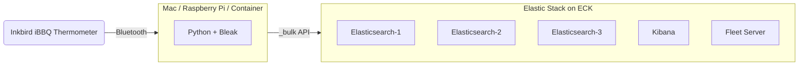

# ECK, BBQ and Pi

## Intro

A demo architecture with a real-world function: capture Bluetooth temperature data from an Inkbird iBBQ thermometer and ship it to Elasticsearch for visualization in Kibana.



## Quick Start

### 1. Set up the Elastic cluster

You need the [ECK operator](https://www.elastic.co/guide/en/cloud-on-k8s/current/k8s-deploy-eck.html) installed, then apply the manifests:

```bash
kubectl apply -f elasticstack/elasticsearch.yaml
kubectl apply -f elasticstack/kibana.yaml
kubectl apply -f elasticstack/fleet.yaml
```

This gives you a 3-node Elasticsearch cluster, Kibana, and Fleet Server, all running Elastic 9.5.

### 2. Set up Python

Works on macOS, Linux (including Raspberry Pi 3/4/5), or in a container.

```bash
python3 -m venv .venv
source .venv/bin/activate
pip install bleak requests
```

### 3. Configure

Copy the example env file and fill in your cluster details:

```bash
cp .env.example .env
# Edit .env with your ES_URL, ES_PASSWORD, etc.
```

### 4. Run

```bash
source .env && python python/pybbq-es.py
```

Or export the variables individually:

```bash
export ES_URL=https://your-cluster:9200
export ES_PASSWORD=your-password
export ES_INDEX=bbq
python python/pybbq-es.py
```

The script will:
- Scan for nearby iBBQ devices over Bluetooth
- Connect and authenticate
- Stream temperature readings to stdout
- Auto-create an Elasticsearch data stream index template and/or a ClickHouse table
- Batch documents and flush to configured outputs via bulk APIs
- Automatically reconnect if the Bluetooth connection drops

You can ship to Elasticsearch, ClickHouse, or both simultaneously.

### Docker

For Raspberry Pi or any Linux host with Bluetooth:

```bash
docker build -t bbq-inkbird .
docker run --rm --net=host --privileged \
  --env-file .env \
  bbq-inkbird
```

`--net=host --privileged` is required for Bluetooth/D-Bus access.

## Configuration

All configuration is via environment variables:

| Variable | Default | Description |
|---|---|---|
| **Elasticsearch** | | |
| `ES_URL` | `https://localhost:9200` | Elasticsearch endpoint |
| `ES_USER` | `elastic` | Elasticsearch username |
| `ES_PASSWORD` | (none) | Elasticsearch password (set to enable ES output) |
| `ES_INDEX` | `bbq` | Data stream name |
| `ES_VERIFY_TLS` | `true` | Verify TLS certificates (`false` for self-signed) |
| **ClickHouse** | | |
| `CH_URL` | (none) | ClickHouse HTTP endpoint, e.g. `http://localhost:8123` (set to enable) |
| `CH_USER` | `default` | ClickHouse username |
| `CH_PASSWORD` | (none) | ClickHouse password |
| `CH_DATABASE` | `bbq` | ClickHouse database name (auto-created) |
| `CH_TABLE` | `readings` | ClickHouse table name (auto-created) |
| **General** | | |
| `TEMP_UNITS` | `f` | Temperature units: `f`, `c`, or `k` |
| `BULK_INTERVAL` | `5` | Seconds between bulk flushes |
| `MAX_RECONNECT_ATTEMPTS` | `10` | BLE reconnect attempts before exiting |
| `RECONNECT_DELAY` | `5` | Seconds between reconnect attempts |
| `DEBUG` | `false` | Enable verbose logging |

## Data Model

Documents are written to an Elasticsearch [data stream](https://www.elastic.co/guide/en/elasticsearch/reference/current/data-streams.html). The index template is created automatically on first run.

Each cook session gets a unique `session_id` (UTC timestamp of script start) for easy filtering in Kibana.

### Temperature document

```json
{"@timestamp": "2026-09-13T18:45:23.123456+00:00", "bbq_temp": 225.3, "bbq_probe": 1, "session_id": "20260913T184523Z"}
```

### Battery document

```json
{"@timestamp": "2026-09-13T18:45:23.123456+00:00", "bbq_battery": 85.2, "session_id": "20260913T184523Z"}
```

## ECK Cluster

The `elasticstack/` directory contains Kubernetes manifests for Elastic 9.5:

- **`elasticsearch.yaml`** — 3-node cluster with self-monitoring
- **`kibana.yaml`** — Kibana with pre-configured Fleet agent policies
- **`fleet.yaml`** — Fleet Server, Elastic Agent DaemonSet, RBAC

These manifests come from the [Kittyhawk](https://github.com/jdel12/eck-kittyhawk/) repo. Adjust resource limits, storage classes, and replica counts to fit your environment.

## Inkbird IBT-4XS

The thermometer should work out of the box — just power it on. Any Bluetooth-enabled Inkbird using the iBBQ protocol should be compatible. The script scans for devices advertising the iBBQ service UUID (`FFF0`) and picks the one with the strongest signal.

Make sure no phone app is connected to the device, as BLE only allows one active connection.

## Acknowledgements

The iBBQ Bluetooth protocol implementation is heavily inspired by [pybq](https://github.com/8none1/pybq) by [8none1](https://github.com/8none1).
