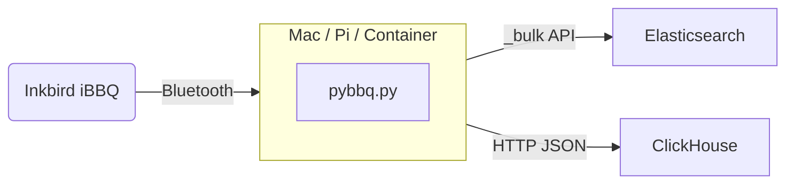

# BBQ Inkbird

Capture Bluetooth temperature data from an Inkbird iBBQ thermometer and store it in Elasticsearch, ClickHouse, or both.



Works on macOS and Linux (including Raspberry Pi). Outputs are opt-in — set `ES_PASSWORD` for Elasticsearch, `CH_URL` for ClickHouse, or both. With neither set, readings print to stdout only.

## Quick Start

### Option A: One-off cook with local ClickHouse (easiest)

No cluster needed. Spin up a local ClickHouse container and run the script:

```bash
# Start ClickHouse
docker compose up clickhouse -d

# Set up Python and run
python3 -m venv .venv && source .venv/bin/activate && pip install bleak requests
CH_URL=http://localhost:8123 python python/pybbq.py
```

That's it. The script auto-creates the database and table, connects to your Inkbird, and starts recording. Query your cook afterward:

```bash
docker exec -it bbq-inkbird-clickhouse-1 clickhouse-client \
  --query "SELECT * FROM bbq.readings ORDER BY timestamp"
```

### Option B: Ship to Elasticsearch

Point at any Elasticsearch cluster (self-managed, ECK, or Elastic Cloud):

```bash
python3 -m venv .venv && source .venv/bin/activate && pip install bleak requests
ES_URL=https://your-cluster:9200 ES_PASSWORD=changeme python python/pybbq.py
```

The script auto-creates a [data stream](https://www.elastic.co/guide/en/elasticsearch/reference/current/data-streams.html) index template with proper field mappings on first run.

For a self-managed ECK cluster, see [ECK Setup](#eck-cluster) below.

### Option C: Both at once

```bash
ES_URL=https://your-cluster:9200 ES_PASSWORD=changeme \
CH_URL=http://localhost:8123 \
python python/pybbq.py
```

### Using a .env file

For repeated use, copy the example and uncomment what you need:

```bash
cp .env.example .env
# Uncomment and fill in the outputs you want
source .env && python python/pybbq.py
```

### Docker (Linux / Raspberry Pi)

On a Linux host with Bluetooth, the `bbq` service handles everything:

```bash
# ClickHouse + bbq script together
docker compose --profile linux up

# Or build and run standalone
docker build -t bbq-inkbird .
docker run --rm --net=host --privileged --env-file .env bbq-inkbird
```

`--net=host --privileged` is required for Bluetooth/D-Bus access. On macOS, run the Python script natively (CoreBluetooth doesn't work inside Docker).

## Configuration

All configuration is via environment variables. Everything has sensible defaults — you only need to set the output(s) you want.

| Variable | Default | Description |
|---|---|---|
| **Elasticsearch** | | *Set `ES_PASSWORD` to enable* |
| `ES_URL` | `https://localhost:9200` | Elasticsearch endpoint |
| `ES_USER` | `elastic` | Username |
| `ES_PASSWORD` | *(none)* | Password |
| `ES_INDEX` | `bbq` | Data stream name |
| `ES_VERIFY_TLS` | `true` | Set `false` for self-signed certs |
| **ClickHouse** | | *Set `CH_URL` to enable* |
| `CH_URL` | *(none)* | HTTP endpoint, e.g. `http://localhost:8123` |
| `CH_USER` | `default` | Username |
| `CH_PASSWORD` | *(none)* | Password |
| `CH_DATABASE` | `bbq` | Database name (auto-created) |
| `CH_TABLE` | `readings` | Table name (auto-created) |
| **General** | | |
| `TEMP_UNITS` | `f` | `f` (Fahrenheit), `c` (Celsius), or `k` (Kelvin) |
| `BULK_INTERVAL` | `5` | Seconds between flushes to outputs |
| `MAX_RECONNECT_ATTEMPTS` | `10` | BLE reconnect attempts before exit |
| `RECONNECT_DELAY` | `5` | Seconds between reconnect attempts |
| `DEBUG` | `false` | Verbose logging |

## Data Model

Each cook session gets a unique `session_id` (UTC timestamp when the script starts, e.g. `20260913T184523Z`) for grouping readings in queries and dashboards.

**Temperature reading:**
```json
{"@timestamp": "2026-09-13T18:45:23+00:00", "bbq_temp": 225.3, "bbq_probe": 1, "session_id": "20260913T184523Z"}
```

**Battery reading:**
```json
{"@timestamp": "2026-09-13T18:45:23+00:00", "bbq_battery": 85.2, "session_id": "20260913T184523Z"}
```

In Elasticsearch, documents go into a data stream. In ClickHouse, they go into a `MergeTree` table ordered by `(session_id, timestamp)`.

## ECK Cluster

The `elasticstack/` directory contains Kubernetes manifests for Elastic 9.5 managed by [ECK](https://www.elastic.co/guide/en/cloud-on-k8s/current/k8s-deploy-eck.html):

```bash
kubectl apply -f elasticstack/elasticsearch.yaml   # 3-node cluster
kubectl apply -f elasticstack/kibana.yaml           # Kibana + Fleet policies
kubectl apply -f elasticstack/fleet.yaml            # Fleet Server + Agent DaemonSet
```

These manifests come from [Kittyhawk](https://github.com/jdel12/eck-kittyhawk/). Adjust resource limits, storage, and replica counts for your environment.

## Inkbird Compatibility

Power on the thermometer — no pairing needed. The script scans for any device advertising the iBBQ service UUID (`FFF0`) and picks the strongest signal. Make sure no phone app is connected (BLE allows one connection at a time).

Tested with the IBT-4XS. Any Inkbird using the iBBQ BLE protocol should work.

## Acknowledgements

iBBQ Bluetooth protocol implementation inspired by [pybq](https://github.com/8none1/pybq) by [8none1](https://github.com/8none1).
